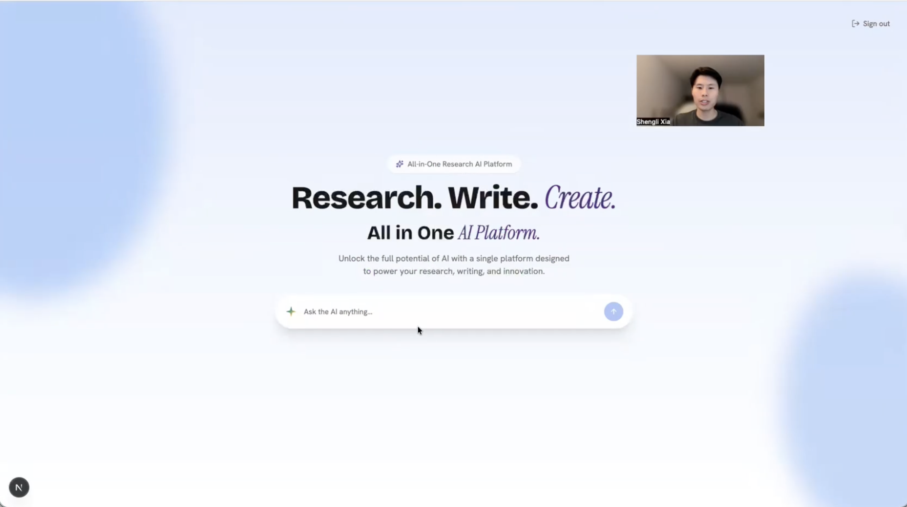
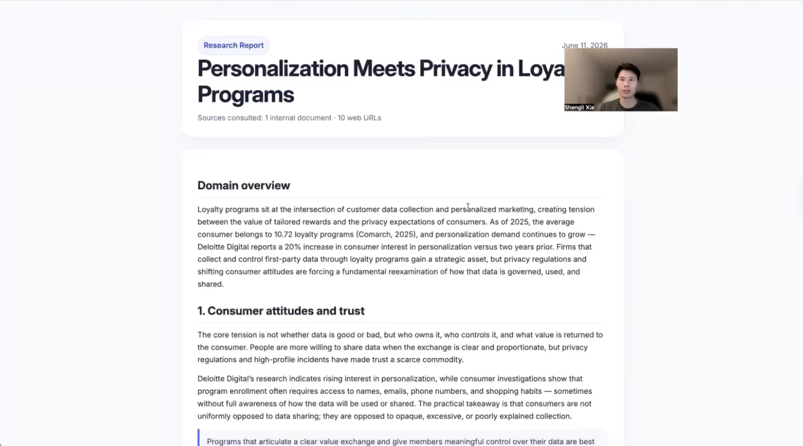
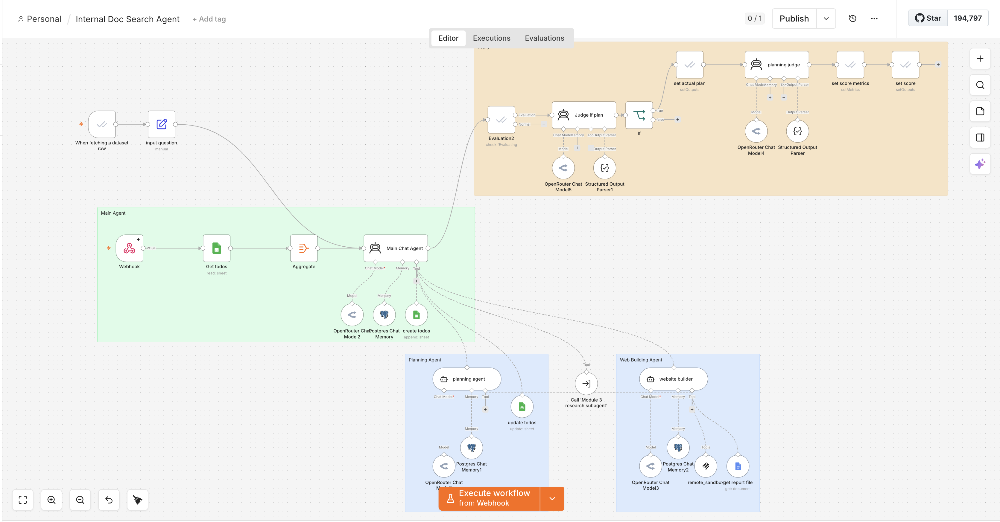
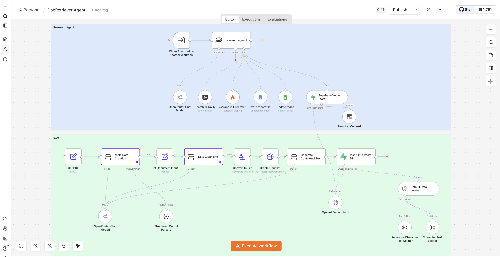

# AI Market Research Agent

An agentic workflow built with n8n that helps junior marketers go from a research question to a fully written market landscape report in minutes - not days.

> **Demo:** [Watch walkthrough](https://drive.google.com/file/d/14oq-BZ20GqcYXKN74eOEZYJQN0YEhpGZ/view?usp=sharing) | **Stack:** n8n, LlamaParse, Supabase, Cohere, Tavily, Firecrawl, Daytona, Google Docs

---

## Problem and Solution

Junior marketers tasked with competitor and market landscape research face a slow, fragmented process: search across internal drives for past reports and decks, switch to the web for current data, then manually compile everything into a document. A task that should take hours routinely takes days to weeks - and most of that time is spent on information gathering, not thinking.

This agent solves that. It takes a research question, clarifies scope through a planning dialogue, searches both internal documents and the web, and delivers a fully written market landscape report in Google Docs. Optionally, it generates a presentation-ready web page for sharing findings with leadership.

---

## Architecture

### Frontend

The marketer interacts with the agent through a **Next.js chatbot UI**, built with Claude Code. It provides a clean conversational interface for submitting research questions, reviewing the research plan, and tracking task progress in real time.



The web builder agent also outputs a **Next.js presentation page** as a separate deliverable - a structured, leadership-ready view of the research findings generated dynamically per research run.



### Backend

The backend is built as an **orchestrator and four specialized subagents** running on n8n. Each subagent handles one concern and is evaluated independently.

```
User (Next.js Chatbot UI)
 |
 v
Main Orchestrator Agent
 |-- Task Manager (Google Sheets)
 |
 |-- Planning Agent
 |-- DocRetrieval + Research Agent
 |      |-- Internal: LlamaParse > Supabase Vector DB > Cohere Rerank
 |      |-- External: Tavily (search) > Firecrawl (scrape)
 |      |-- Output: Google Doc report
 |
 |-- Web Builder Agent
        |-- Daytona sandbox > Next.js UI page
```

**Main Orchestrator** - manages the overall workflow, delegates tasks to subagents, and maintains task state in Google Sheets so the agent can resume if interrupted.



**Planning Agent** - clarifies the research question before any retrieval begins. Asks targeted questions, suggests specific research areas, and iterates with the user until the plan is confirmed.

**DocRetrieval + Research Agent** - the core of the system. Searches internal documents via a RAG pipeline (LlamaParse, Supabase, Cohere) and the web (Tavily, Firecrawl), then writes a structured report to Google Docs.



**Web Builder Agent** - takes the finished report and generates a presentation-ready Next.js page using Daytona as the sandbox, giving marketers a polished leadership-ready deliverable.

---

## Technical Decisions: Q&A

### Why four separate agents instead of one?

Three reasons, each distinct:

1. **Context window management** - a complex multi-step research workflow stuffed into a single agent causes window overflow and hallucination. Each subagent operates with only the context it needs.
2. **Per-task quality control** - each subagent can be independently prompted, tuned, and evaluated. A planning task requires very different prompting than a retrieval task.
3. **Cost optimization** - not every task needs a frontier model. Web search and scraping use a mid-tier model; reasoning-heavy tasks use the most capable model. This cuts cost without sacrificing quality where it matters.

---

### Why does the orchestrator use Google Sheets for task tracking?

LLMs lose track of multi-step workflows as context grows - especially when each step involves heavy content like retrieved documents. Externalizing task state to Google Sheets solves this cleanly: before taking any action, the agent reads the sheet to pick up its current state; after each task completes, it updates the status and moves on.

This also makes the agent **resumable**. If a run fails or times out mid-workflow, it picks up from the last completed task rather than restarting from scratch. The four tracked tasks are: Clarify research questions, Draft research plan, Clarify output format, Create report.

---

### How does the internal document RAG pipeline work?

The RAG pipeline is designed specifically for a messy, multimodal internal corpus - not generic text files. Each step exists for a reason.

**Step 1: Parse with LlamaParse**
I convert all source files (PDFs, decks, contracts) to clean Markdown first. Standard parsers fail on this corpus - they mangle tables and drop content from complex layouts. LlamaParse preserves document structure regardless of format.

**Step 2: Extract Metadata**
An LLM extracts document title, summary, and type before any chunking. This metadata attaches to every chunk later, enabling filtering by document attributes before vector search runs - narrowing the search space at query time.

**Step 3: Cleanse**
I strip boilerplate, headers, and formatting noise as an explicit stage. Everything downstream operates on signal, not artifacts.

**Step 4: Chunk via Unstructured API**
Unstructured handles parsing and chunking together. Unlike generic text splitters, it understands document structure - chunking a table differently from a paragraph and preserving semantic boundaries.

**Step 5: Generate Contextual Overview per Chunk**
Before embedding, an LLM generates a contextual description for each chunk. The final embedded unit is:
```
Contextual Overview: [context about this chunk]
---
[chunk content]
```
Raw chunk embeddings lose surrounding context. This ensures the vector captures not just what the text says but what it represents - significantly improving retrieval precision for nuanced queries. Metadata (title, summary) is attached for additional filtering at query time.

**Step 6: Embed and Store**
Combined units are embedded via OpenAI and stored in Supabase. At query time, Cohere rerank re-scores results by relevance before they reach the LLM - because semantic similarity is not the same as relevance.

---

### Why add Cohere rerank on top of vector search?

Semantic similarity is not the same as relevance. Vector search finds chunks that are topically close to the query - but two chunks can be near-identical in embedding space while one is far more useful for the specific research question asked.

Cohere rerank does a second pass using a cross-encoder model - reading the query and each retrieved chunk together in context rather than comparing pre-computed vectors independently. This captures query-chunk interaction that bi-encoder models miss.

Design principle: **vector search casts a wide net, Cohere picks the best results from it.**

I validated this directionally through manual spot-checking on representative research queries - comparing top results with and without reranking - and the improvement in precision was clear enough to justify the added latency and cost.

---

### Why both Tavily and Firecrawl for web research?

They do different jobs. Tavily is a search tool - it returns relevant source URLs and snippets, optimized for finding the right pages quickly. Firecrawl is a scraping tool - it extracts full page content reliably for the LLM to reason over.

Tavily can return raw page content, but it's not its core purpose and results are inconsistent. Firecrawl is purpose-built for clean, reliable full-page extraction. Using each tool for what it does best gives better reliability than relying on one tool for both jobs.

---

### Why a web builder agent for output?

A Google Doc works for internal reference and drafting, but when a junior marketer needs to present findings to leadership, format matters. The web builder agent generates a structured, scannable UI page - visual hierarchy, clear sections, no wall of text. It gives marketers a polished presentation-ready artifact without needing design skills or a separate tool like Notion or Canva.

### Why Daytona as the sandbox for web page generation?

LLM-generated code execution needs a sandbox. Daytona provides an isolated virtual environment so agent-generated code never touches the host system - protecting against buggy output, unexpected side effects, and prompt injection risks. Each build spins up a clean environment, runs, and is torn down after use. The host machine is never exposed.

---

## Evaluation

I evaluated each subagent independently before end-to-end testing - equivalent to unit testing in software. Isolating failures at the subagent level means I can pinpoint exactly where quality breaks down rather than debugging the full pipeline blind.

**Methodology**
- Pre-created a golden output set defining what "good" looks like for each subagent
- Built a structured test set with difficulty tiers - easy queries as baseline checks, medium queries to stress-test domain specificity, harder queries for niche or emerging topics. Each test case was selected with an explicit reason: what specific behavior does this expose?
- Used a separate LLM as judge to score outputs against a rubric, returning a written rationale and the single most impactful improvement per test case

**Planning Agent Rubric**

Scored 1-5 across five dimensions: Specificity, Domain Tailoring, Format Compliance, Rationale Quality, and Scope Appropriateness.

Scores ranged from 2.5 to 3.83. The consistent failure pattern was not in content - Specificity and Domain Tailoring often scored 5/5 - but in format compliance and rationale quality. The agent skipped required structural elements like the "Why this plan" section. This told me the problem was prompt structure, not model capability - a precise, fixable finding.

**Adversarial Testing**

I deliberately fed unethical and ambiguous queries to validate the agent rejects or handles them gracefully rather than blindly executing.

---

## Guardrails

Guardrails are layered to catch problems as early - and as cheaply - as possible.

| Layer | Mechanism | What It Prevents |
|---|---|---|
| Input validation | Hardcoded check, pre-LLM | Oversized inputs from bad actors; runs before the LLM is ever involved |
| Resource limits | Prompt-level | Max retries and token limits prevent infinite loops and runaway API costs |
| Data security | Prompt-level | Sensitive information (SSN, API keys, confidential data) detected before output is returned |

**Design principle:** hardcoded checks are free. Prompt guardrails are cheap. Relying on the LLM to self-police is expensive and unreliable. Each guardrail sits at the earliest point in the pipeline where it can act.

---

## Tech Stack

**Frontend**

| Component | Tool | Why |
|---|---|---|
| Chatbot UI | Next.js + Claude Code | Clean conversational interface; Claude Code used to scaffold and design the UI |
| Research output page | Next.js (generated) | Presentation-ready deliverable built dynamically per research run |

**Backend**

| Component | Tool | Why |
|---|---|---|
| Workflow orchestration | n8n | Visual, auditable agent flows |
| Document parsing | LlamaParse | Handles multimodal, messy internal docs |
| Vector database | Supabase | Stores and retrieves embedded chunks |
| Reranking | Cohere | Cross-encoder precision over vector similarity |
| Web search | Tavily | Fast, relevant source discovery |
| Web scraping | Firecrawl | Reliable full-page content extraction |
| Task memory | Google Sheets | External task state for resumability |
| Report output | Google Docs | Native marketer workflow |
| Web page sandbox | Daytona | Safe code execution for UI generation |

---

## Repo Structure

```
/
|-- workflows/          # n8n workflow JSON exports (importable)
|-- docs/
|   |-- architecture.png
|   |-- screenshots/
|-- demo/               # Link to demo video
|-- README.md
```

---

## Setup

> Coming soon - setup instructions for deploying the full stack.

---

## Author

Built by Shengli Xia as a portfolio project demonstrating applied AI agent design, RAG pipeline construction, and production-readiness thinking.
